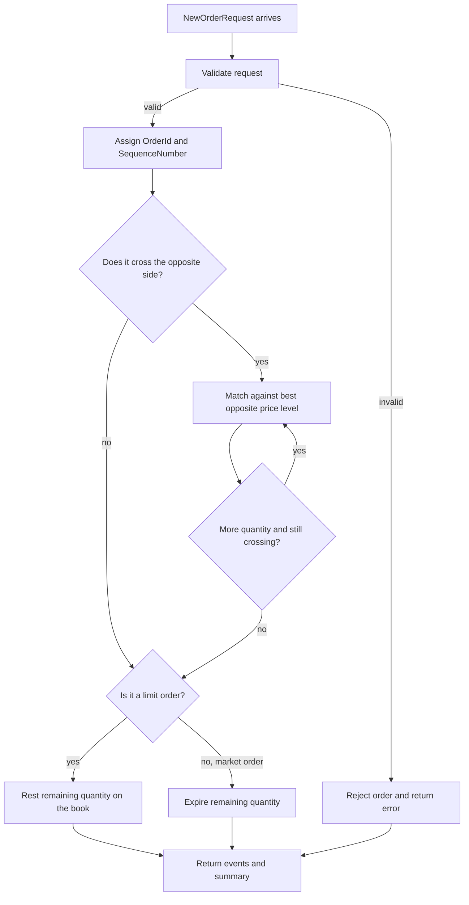
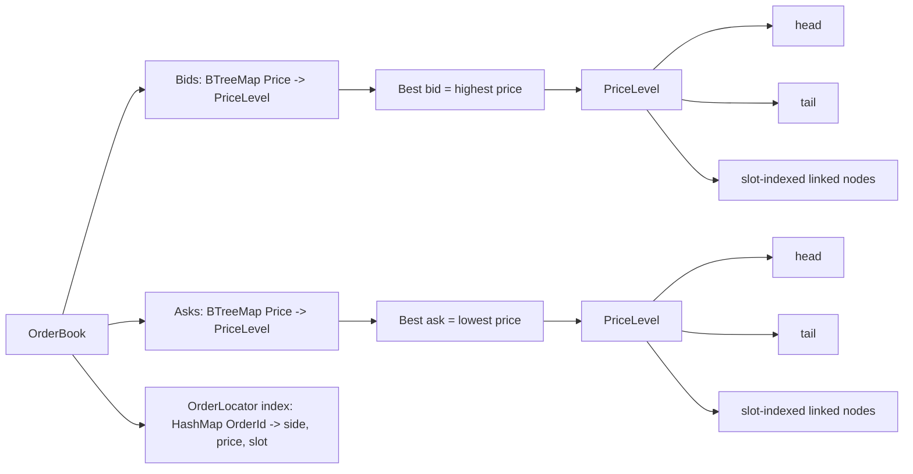
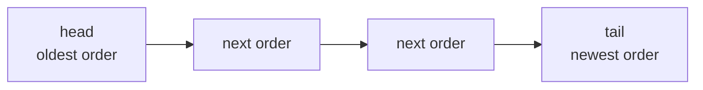

# 06 Visual Guide

This chapter gives you a picture of the engine before you dive back into code.

If the code feels dense, come back here first.

## Diagram 1: Order flow through the engine



### Plain-English version

The engine does three big things:

1. decide whether the request is allowed
2. decide whether it trades now or rests
3. return a record of what happened

That is the whole system at a high level.

## Diagram 2: How the book is organized in memory



### Plain-English version

Think of the state like this:

- the book has a bids side and an asks side
- each side is grouped by price
- each price has its own FIFO line of orders
- the locator index is a shortcut for cancellation

The engine does not search the whole book for every cancel.
It uses `OrderId -> side, price, slot` to jump close to the target.

## Diagram 3: FIFO inside one price level



Rules:

- new resting orders go to the tail
- matching consumes from the head
- equal prices use FIFO
- cancel removes the known slot directly

That is how the engine preserves time priority inside a price level.

## Worked example: one resting ask, then one crossing bid

Use this scenario:

1. Ask: sell `2.000 SOL` at `101.00`
2. Bid: buy `1.500 SOL` at `101.00`

### Step 1: the ask arrives

The engine validates the ask.

It is a limit order, so it has a price.
There is no resting bid that can trade with it.
So it rests on the ask side.

Book after step 1:

```text
Bids: empty
Asks:
  101.00 -> [sell 2.000]
```

### Step 2: the bid arrives

The engine validates the bid.

It sees the best ask is `101.00`.
Because the bid price is also `101.00`, the bid crosses the ask.

Trade:

- maker = resting ask
- taker = incoming bid
- trade price = `101.00` (maker price)
- trade quantity = `1.500`

### Step 3: quantities update

The incoming bid is fully filled.

The resting ask is only partially filled:

- original ask quantity = `2.000`
- traded quantity = `1.500`
- remaining ask quantity = `0.500`

Book after step 3:

```text
Bids: empty
Asks:
  101.00 -> [sell 0.500]
```

### What you should notice

- the incoming order did not become the maker
- the price came from the resting order
- the partially filled ask stayed on the book
- the bid disappeared because it was fully filled

## Worked example: market order sweeps multiple price levels

Use this scenario:

```text
Asks:
  101.00 -> [sell 1.000]
  101.50 -> [sell 2.000]
  102.00 -> [sell 3.000]
```

Incoming order:

- market buy `2.500`

### What happens

The market buy has no limit price, so it consumes the best asks available.

It trades in this order:

1. take `1.000` at `101.00`
2. then take `1.500` at `101.50`

It stops there because the incoming order is now fully filled.

Book afterward:

```text
Asks:
  101.50 -> [sell 0.500]
  102.00 -> [sell 3.000]
```

What to notice:

- the engine used best price first
- it crossed multiple price levels
- the maker price still set each trade price
- the incoming market order did not rest

## Reading a study terminal without overthinking the labels

When you look at a study UI or trade tape, some small labels are there to tell you where the numbers came from, not just what the side was.

Example trade row:

```text
BUY   171.98   Mock Engine   0.420   14:32:08
```

How to read it:

- `BUY`: the aggressive side shown for that trade row
- `171.98`: the trade price
- `Mock Engine`: the source or venue label
- `0.420`: the traded size
- `14:32:08`: the displayed trade time

### What “venue” means in a UI

Venue means where the trade happened or which system produced it.

In a real terminal, venue could be:

- a real exchange
- a matching engine
- an ECN
- a routing destination

In a learning terminal, venue may instead say something like:

- `Mock`
- `Simulated`
- `Paper`
- `Mock Engine`

Those labels mean the trade flow is for study, testing, or UI development rather than live market activity.

### Mock vs simulated vs paper vs live

Use this mental model:

- `Mock`: fake data used to build or study the interface
- `Simulated`: fake but behavior-shaped to resemble a real market or engine
- `Paper`: pretend trading without real money
- `Live`: real market or production data

If a label feels confusing, do not assume it means a new exchange concept.
Often it is just telling you whether the data is real or synthetic.

## Worked example: how cancel finds a resting order

Imagine the book already contains a resting buy order:

```text
Bids:
  100.00 -> [buy order id 42]
```

The locator index stores something like:

```text
42 -> (Buy, 100.00, slot 7)
```

That means:

- `Buy`: the order is on the bids side
- `100.00`: the order is inside the 100.00 price level
- `slot 7`: the exact slot inside that level

### Cancel flow in plain English

1. caller asks to cancel `OrderId 42`
2. engine looks up `42` in the locator map
3. engine jumps directly to the bids side
4. engine jumps directly to price level `100.00`
5. engine removes the order from `slot 7`
6. engine updates the locator map
7. if the level becomes empty, the level is removed too

Why this matters:

- the engine does not scan the whole book
- the engine does not scan the whole price level
- cancel is fast because it already knows where to go

## How to use this chapter while studying code

When reading [src/matching.rs](/Users/joeyalvarado/Developer/solbook-core/src/matching.rs):

1. keep Diagram 1 open to remember the broad flow
2. keep Diagram 2 open to remember where state lives
3. keep the worked examples nearby and compare the code to the examples

If you can connect the code back to these pictures, you are learning the right
way.
